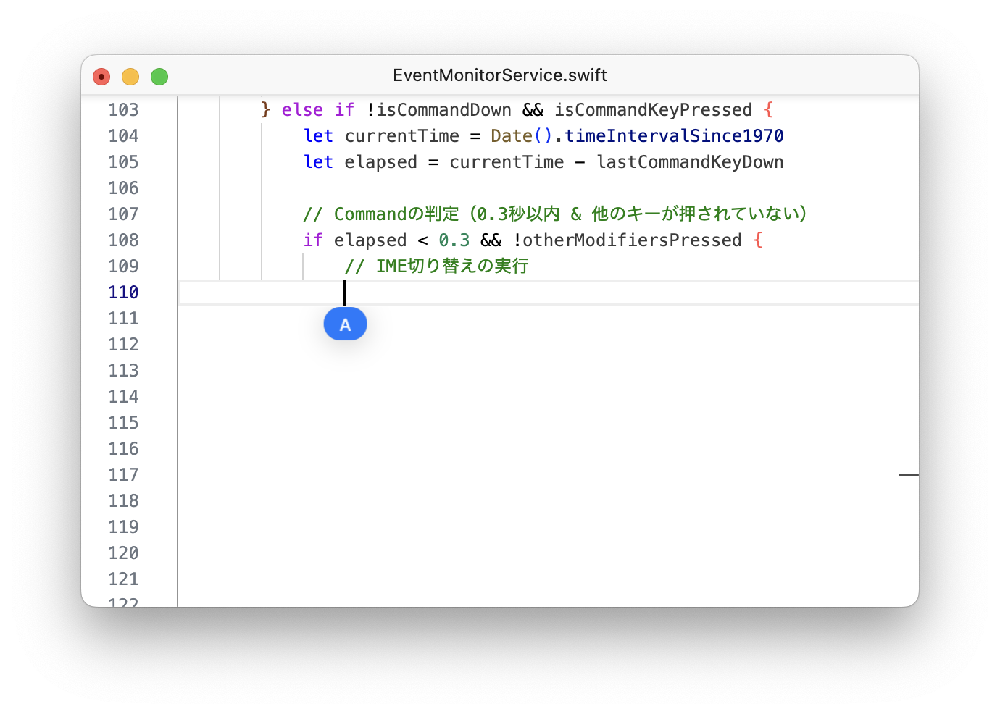

# README.md

**日本語** | [English](./README_EN.md)

<div align="center">
  <h1>Kanary</h1>
  <p>左右の Command キーで IME を切り替える macOS ユーティリティ</p>
  
</div>

## 概要

**Kanary** は、**左/右 Command キー** で英数・かな入力を切り替えられる軽量ツールです  
通常のショートカットと干渉しない設計で、アクセシビリティ許可を与えるだけで動作します

## 特徴

1. **Commandキーで簡単切り替え**  
   - 左Commandで英数、右Commandでかな入力に  

2. **シンプル・軽量設計**  
   - メニューバーからオン/オフ切り替え  
   - 特定のアプリを除外できます。

3. **システム機能との両立**  
   - 長押し（約0.3秒以上）や他のキーとの組み合わせの場合は切り替えがキャンセルされ、通常のmacOSショートカットが優先されます
   
   > Apple Intelligenceの起動判定のため、IME切り替えには0.3秒の遅延が入ります
   （「今後の計画」を参照ください）

4. **アップデートチェック内蔵**  
   - 新しいバージョンがあれば通知＆自動ダウンロード可能

## 動作環境

- **対応OS**: macOS 13.5以降  
- **CPU**: Apple Silicon  
- **必須権限**: システム環境設定「プライバシーとセキュリティ > アクセシビリティ」で許可が必要  
- **キーボード配列**: US配列（他の配列では動作が安定しない場合があります）

## インストール

1. [Releases](https://github.com/shntt/kanary/releases) から最新の `Kanary.dmg` をダウンロード  
2. `Kanary.dmg` を開き、`Kanary.app` をアプリケーションフォルダに移動  
3. 初回起動時、指示に従いアクセシビリティ権限を付与する  

### アンインストール

1. アプリケーションフォルダの `Kanary.app` を削除  
2. 必要なら以下を削除して設定をリセット  
   ```
   ~/Library/Preferences/com.shntt.kanary.plist
   ~/Library/Caches/com.shntt.kanary/
   ```

## 今後の計画

- **他の配列（UK / JISなど）への対応**  
- **キー割り当ての自由化**（例: Caps LockやOptionに変更）  
- **より細かなカスタマイズ**: IME切り替えまでの遅延やサウンド/通知オプション  

意見・要望は [Issues](https://github.com/shntt/kanary/issues) にてお寄せください

## ビルド方法（開発向け）

1. リポジトリをクローン
   ```bash
   git clone https://github.com/shntt/kanary.git
   cd kanary
   ```
2. Xcode（15.0以上）で `Kanary.xcodeproj` を開く  
3. ビルド（⌘+R）実行 → メニューバーに常駐して動作確認できます

## 貢献方法

- バグ報告 / 機能提案: [Issues](https://github.com/shntt/kanary/issues)  
- コード修正 / 新機能追加: [Pull Requests](https://github.com/shntt/kanary/pulls)

1. ブランチ作成（例：`feature/uk-layout-support`）  
2. 修正後テスト  
3. Pull Request 送信  

詳しくは [CONTRIBUTING.md](./CONTRIBUTING.md) をご覧ください

## ライセンス

本ソフトウェアは [MIT License](./LICENSE.md) で公開しています

## 謝辞

- **英かな** をはじめとする macOS 向けIME切り替えツールに大きくインスパイアされています
- オープンソースコミュニティに感謝いたします  