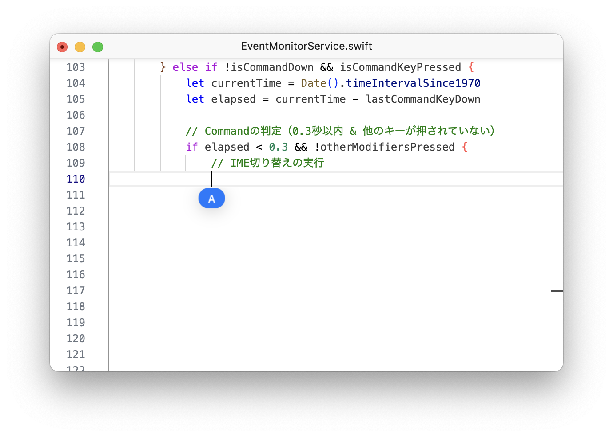

# README_EN.md
[日本語 (Japanese)](./README.md) | **English**

<div align="center">
  
  <h1>Kanary</h1>
  <p>A macOS utility to switch IME with left and right Command keys</p>
</div>

---

## Overview

**Kanary** is a lightweight macOS tool that lets you quickly switch between **Alphanumeric** and **Kana** input modes by simply pressing the left or right Command keys. It currently supports **US keyboard layouts** and requires **Accessibility** permission to function.

- **Left Command** (single press) → Alphanumeric  
- **Right Command** (single press) → Kana (Japanese)  
- If you **long-press (over 0.3 seconds)** or **press other modifier keys** (Shift, Option, etc.) at the same time, Kanary will not switch IME, allowing standard macOS shortcuts to work normally (e.g., Command + C).

> **Note**:  
> - The app is primarily tested on **US keyboard** layouts. UK layouts, JIS, and others may behave inconsistently.  
> - Future updates will address broader keyboard support and older macOS versions.

---

## Features

1. **Simple IME Toggle**  
   - Instant switch with a quick tap of the left/right Command keys  
   - Commands remain unaffected for usual shortcuts (e.g., Command + V)  

2. **Per-Application Settings**  
   - Enable or disable Kanary specifically for certain apps  
   - Useful if you want to exclude games or specialized software from accidental IME toggling  

3. **Auto-Launch at Login**  
   - Keep Kanary running in the menu bar after macOS starts  

4. **Update Checker & DMG Download**  
   - Automatically checks GitHub Releases for the latest version  
   - Supports one-click DMG download and mounting  

5. **Lightweight & Intuitive**  
   - Only requires Accessibility permission, no complicated system extensions  
   - Minimal resource usage, modern SwiftUI-based UI  

---

## Requirements

- **macOS**: Version 13.5 or later (e.g., Ventura 13.5, Sonoma 14.0)  
- **CPU**: Apple Silicon or Intel-based Mac  
- **Keyboard Layout**: Officially supports US layout in current version  
- **Accessibility**: Must grant Accessibility permission to Kanary

> **Planned**:  
> - Support for older macOS (e.g., 12.x / Monterey)  
> - Support for other keyboard layouts (UK, JIS, etc.)  
> - More customizable key assignments

---

## Installation

1. Download the latest **Kanary.dmg** from the [Releases](https://github.com/shntt/kanary/releases) page.  
2. Open the `Kanary.dmg` file and drag **Kanary.app** into your Applications folder.  
3. Launch **Kanary.app**. The first time you run it, macOS will prompt you to grant **Accessibility** permission. Follow the instructions to allow it.  
4. Look for the Command icon in your menu bar—Kanary is now ready.

### Uninstallation

1. Delete `Kanary.app` from your Applications folder.  
2. Optionally remove related files:  
   ```
   ~/Library/Preferences/com.shntt.kanary.plist
   ~/Library/Caches/com.shntt.kanary/
   ```
3. If auto-launch was enabled, it will be deactivated once the app is removed.

---

## Usage

1. Click the **Command icon** in the menu bar and ensure **Enable** is checked.  
2. **Tap the Left Command key** (briefly) to switch to **Alphanumeric** input.  
3. **Tap the Right Command key** (briefly) to switch to **Kana** input.  
4. Long-pressing the Command key (over 0.3s) or pressing other modifier keys together (Shift, Option, etc.) will **bypass Kanary** so standard macOS shortcuts remain intact.

### Per-App Enable/Disable

- In **Preferences → Applications**, you can toggle Kanary for specific apps.  
- Example: keep it disabled for certain games or specialized software.

---

## Roadmap / Future Plans

- **Support for other keyboard layouts** (UK, JIS, etc.)  
- **Customizable key mappings** (allow using other keys than Command)  
- **Backport to older macOS versions** (12.x, 11.x) if there's enough demand  
- **Additional customization** (e.g., adjustable long-press threshold, optional audio/visual notifications on IME switch)

We welcome suggestions! Feel free to open an [Issue](https://github.com/shntt/kanary/issues) if you have any requests or find bugs.

---

## Building from Source

1. Clone this repository:
   ```bash
   git clone https://github.com/shntt/kanary.git
   cd kanary
   ```
2. Open `Kanary.xcodeproj` in [Xcode 15+](https://developer.apple.com/xcode/).  
3. Build and run with **⌘+R**. The app will appear in the menu bar.

> **Note**: Running locally also requires Accessibility permission. If your build doesn't respond, check macOS security settings.

---

## License

**Kanary** is distributed under the [MIT License](./LICENSE). Please see the [LICENSE file](./LICENSE) for details.

---

## Contributing

We appreciate bug reports, feature ideas, and code contributions via [Issues](https://github.com/shntt/kanary/issues) and [Pull Requests](https://github.com/shntt/kanary/pulls).

1. Create a feature branch (e.g., `feature/uk-layout-support`)  
2. Make changes or add features  
3. Test thoroughly, then open a Pull Request  

Check out our **CONTRIBUTING.md** for more details.

---

## Acknowledgments

- Inspired by earlier macOS IME-switching tools such as **英かな** and the supportive macOS developer community.  
- Special thanks to all open-source resources and contributors who made this project possible.